# core


<!-- WARNING: THIS FILE WAS AUTOGENERATED! DO NOT EDIT! -->

## A portfolio

To create a portfolio you simply pass the return streams and weights to
the portfolio class. It expects monthly return streams. The best way is
to gather all your raw, monthly return streams in a single dataframe,
including the risk-free (cash-rate) asset. That way you can check for
gaps in the data and validate that the data lines up properly before
passing it to the portfolio.

The risk free rate will be used to transform the return streams to
excess return streams (in excess of risk free).

------------------------------------------------------------------------

<a
href="https://github.com/northarray/portfolio/blob/main/portfolio/core.py#L33"
target="_blank" style="float:right; font-size:smaller">source</a>

### Portfolio

``` python
def Portfolio(
    name:str, return_streams:pandas.DataFrame, weights:dict, rf:pandas.DataFrame=None, cpi:pandas.DataFrame=None,
    funding_spread:float=0.0, start:NoneType=None, end:NoneType=None
):
```

Let’s generate sample data for use in analysis

``` python
rets, rf, cpi = sample_data_se()
```

``` python
rets.head(2)
```

<div>
<style scoped>
    .dataframe tbody tr th:only-of-type {
        vertical-align: middle;
    }
&#10;    .dataframe tbody tr th {
        vertical-align: top;
    }
&#10;    .dataframe thead th {
        text-align: right;
    }
</style>

<table class="dataframe" data-quarto-postprocess="true" data-border="1">
<thead>
<tr style="text-align: right;">
<th data-quarto-table-cell-role="th"></th>
<th data-quarto-table-cell-role="th">stocks</th>
<th data-quarto-table-cell-role="th">bonds</th>
</tr>
</thead>
<tbody>
<tr>
<td data-quarto-table-cell-role="th">1953-10</td>
<td>-0.006897</td>
<td>0.005687</td>
</tr>
<tr>
<td data-quarto-table-cell-role="th">1953-11</td>
<td>0.018286</td>
<td>0.003030</td>
</tr>
</tbody>
</table>

</div>

``` python
rf.head(2)
```

    date
    1856-11    0.004167
    1856-12    0.004167
    Freq: M, Name: rf, dtype: float64

``` python
cpi.head(2)
```

    date
    1955-02    0.001703
    1955-03    0.001932
    Freq: M, Name: cpi, dtype: float64

We make a simple 60/40 portfolio

``` python
p = Portfolio('60/40', rets, {'bonds': .40, 'stocks': .60}, rf=rf, cpi=cpi)
p
```

    {'bonds': 0.4, 'stocks': 0.6}

``` python
p.name
```

    '60/40'

Sometimes we want to inspect the start and end dates of the raw data
that a portfolio uses and whether there are missing data points.

------------------------------------------------------------------------

<a
href="https://github.com/northarray/portfolio/blob/main/portfolio/core.py#L62"
target="_blank" style="float:right; font-size:smaller">source</a>

### Portfolio.availability

``` python
def availability():
```

*Information on the underlying data powering the analysis*

``` python
p.availability
```

<div>
<style scoped>
    .dataframe tbody tr th:only-of-type {
        vertical-align: middle;
    }
&#10;    .dataframe tbody tr th {
        vertical-align: top;
    }
&#10;    .dataframe thead th {
        text-align: right;
    }
</style>

<table class="dataframe" data-quarto-postprocess="true" data-border="1">
<thead>
<tr style="text-align: right;">
<th data-quarto-table-cell-role="th"></th>
<th data-quarto-table-cell-role="th">start</th>
<th data-quarto-table-cell-role="th">end</th>
<th data-quarto-table-cell-role="th">observations</th>
<th data-quarto-table-cell-role="th">missing_months</th>
</tr>
</thead>
<tbody>
<tr>
<td data-quarto-table-cell-role="th">returns</td>
<td>1953-10</td>
<td>2025-01</td>
<td>856</td>
<td>0</td>
</tr>
<tr>
<td data-quarto-table-cell-role="th">rf</td>
<td>1856-11</td>
<td>2026-04</td>
<td>2034</td>
<td>0</td>
</tr>
<tr>
<td data-quarto-table-cell-role="th">cpi</td>
<td>1955-02</td>
<td>2024-03</td>
<td>830</td>
<td>0</td>
</tr>
</tbody>
</table>

</div>

It is also convenient to be able to examine performance in different
time periods.

------------------------------------------------------------------------

<a
href="https://github.com/northarray/portfolio/blob/main/portfolio/core.py#L71"
target="_blank" style="float:right; font-size:smaller">source</a>

### Portfolio.between

``` python
def between(
    start:NoneType=None, end:NoneType=None
):
```

*Changes performance time period from start to end*

``` python
p.return_streams.index.min(), p.return_streams.index.max()
```

    (Period('1953-10', 'M'), Period('2025-01', 'M'))

If we want to limit our analysis to between 2010 and 2020 we do like
this

``` python
p = p.between('1/1995', '1/2000')
```

``` python
p.return_streams.index.min(), p.return_streams.index.max()
```

    (Period('1995-01', 'M'), Period('2000-01', 'M'))

It is possible to re-slice again to a larger window

``` python
p = p.between('1/1900', '1/2024')
```

``` python
p.return_streams.index.min(), p.return_streams.index.max()
```

    (Period('1953-10', 'M'), Period('2024-01', 'M'))

The portfolio return is the excess return your portfolio makes each
month

------------------------------------------------------------------------

<a
href="https://github.com/northarray/portfolio/blob/main/portfolio/core.py#L84"
target="_blank" style="float:right; font-size:smaller">source</a>

### Portfolio.port_rets

``` python
def port_rets(
    excess:bool=True, agg:bool=True
):
```

*Monthly portfolio return*

``` python
p.port_rets().head(2)
```

    1953-10   -0.004364
    1953-11    0.009892
    Freq: M, Name: 60/40, dtype: float64

If we do not supply a rf, the excess return does not work

``` python
test_fail(
    lambda: Portfolio('60/40', rets, {'bonds': .40, 'stocks': .60}).port_rets(),
    contains="no risk-free rate"
)
```

## Portfolio Metrics and Stats

------------------------------------------------------------------------

<a
href="https://github.com/northarray/portfolio/blob/main/portfolio/core.py#L102"
target="_blank" style="float:right; font-size:smaller">source</a>

### Portfolio.stats

``` python
def stats():
```

*Excess return, volatility and sharpe ratio (annualised)*

``` python
s = p.stats()
s
```

    expected_return    0.054973
    volatility         0.113354
    sharpe_ratio       0.484965
    Name: 60/40, dtype: float64

------------------------------------------------------------------------

<a
href="https://github.com/northarray/portfolio/blob/main/portfolio/core.py#L110"
target="_blank" style="float:right; font-size:smaller">source</a>

### Portfolio.cum_return

``` python
def cum_return():
```

*Cumulative compounded total return*

``` python
p.cum_return().head(2)
```

    1953-10    0.998136
    1953-11    1.010297
    Freq: M, Name: 60/40, dtype: float64

------------------------------------------------------------------------

<a
href="https://github.com/northarray/portfolio/blob/main/portfolio/core.py#L117"
target="_blank" style="float:right; font-size:smaller">source</a>

### Portfolio.real_r

``` python
def real_r(
    components:bool=False
):
```

*Real (inflation-adjusted) return*

We only get inflation adjusted returns based on when our inflation data
exists.

``` python
p.availability
```

<div>
<style scoped>
    .dataframe tbody tr th:only-of-type {
        vertical-align: middle;
    }
&#10;    .dataframe tbody tr th {
        vertical-align: top;
    }
&#10;    .dataframe thead th {
        text-align: right;
    }
</style>

<table class="dataframe" data-quarto-postprocess="true" data-border="1">
<thead>
<tr style="text-align: right;">
<th data-quarto-table-cell-role="th"></th>
<th data-quarto-table-cell-role="th">start</th>
<th data-quarto-table-cell-role="th">end</th>
<th data-quarto-table-cell-role="th">observations</th>
<th data-quarto-table-cell-role="th">missing_months</th>
</tr>
</thead>
<tbody>
<tr>
<td data-quarto-table-cell-role="th">returns</td>
<td>1953-10</td>
<td>2025-01</td>
<td>856</td>
<td>0</td>
</tr>
<tr>
<td data-quarto-table-cell-role="th">rf</td>
<td>1856-11</td>
<td>2026-04</td>
<td>2034</td>
<td>0</td>
</tr>
<tr>
<td data-quarto-table-cell-role="th">cpi</td>
<td>1955-02</td>
<td>2024-03</td>
<td>830</td>
<td>0</td>
</tr>
</tbody>
</table>

</div>

``` python
p.real_r().head(2)
```

    1955-02    0.001710
    1955-03    0.008901
    Freq: M, dtype: float64

Since cpi data starts in 1955 we should expect real returns to only show
up in 1955 even though we have returns data since 1953

------------------------------------------------------------------------

<a
href="https://github.com/northarray/portfolio/blob/main/portfolio/core.py#L128"
target="_blank" style="float:right; font-size:smaller">source</a>

### Portfolio.real_w

``` python
def real_w():
```

*Real total wealth, your total compounded wealth less inflation*

``` python
p.real_w().head(2)
```

    1955-02    1.001710
    1955-03    1.010626
    Freq: M, Name: 60/40, dtype: float64

------------------------------------------------------------------------

<a
href="https://github.com/northarray/portfolio/blob/main/portfolio/core.py#L137"
target="_blank" style="float:right; font-size:smaller">source</a>

### Portfolio.roll_return

``` python
def roll_return(
    months:int=12, excess:bool=True, extras:bool=False, forward:bool=False
):
```

*Rolling return (linearly summed) expressed in annualised terms.*

``` python
p.roll_return(24).plot()
```

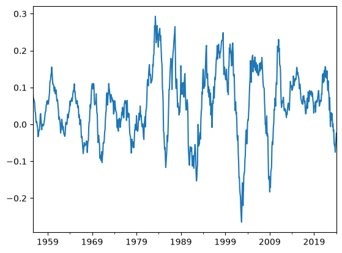

We can also ask for cpi and rf to get a better feel of returns and
conditions

``` python
p.roll_return(24, excess=False, extras=True).plot()
```

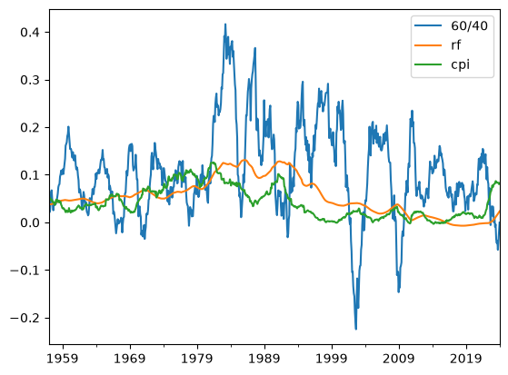

------------------------------------------------------------------------

<a
href="https://github.com/northarray/portfolio/blob/main/portfolio/core.py#L149"
target="_blank" style="float:right; font-size:smaller">source</a>

### Portfolio.cum_excess_return

``` python
def cum_excess_return():
```

*Cumulative sum of monthly returns (no compounding)*

``` python
p.cum_excess_return().plot()
```

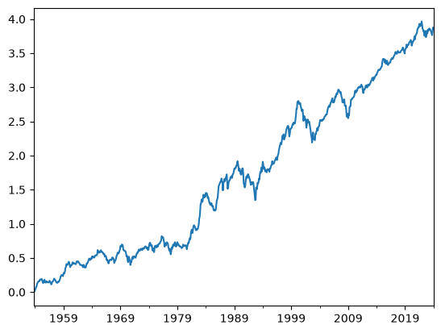

Shows how portfolio performs each month, upwards sloping means we are
doing better than risk-free, downward sloping means we are doing worse.
Flat means we are same. Does not use compounding.

------------------------------------------------------------------------

<a
href="https://github.com/northarray/portfolio/blob/main/portfolio/core.py#L155"
target="_blank" style="float:right; font-size:smaller">source</a>

### Portfolio.detrended_cum_return

``` python
def detrended_cum_return():
```

*Cumulative sum of returns minus long-run mean*

``` python
p.detrended_cum_return().plot()
```

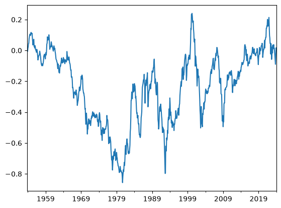

This makes it easier to see environmental biases: periods where an asset
did worse or better than its average.

## Comparing portfolios

------------------------------------------------------------------------

<a
href="https://github.com/northarray/portfolio/blob/main/portfolio/core.py#L168"
target="_blank" style="float:right; font-size:smaller">source</a>

### compare

``` python
def compare(
    *portfolios, metric:str='stats', **kwargs
):
```

*Compares two portfolios using a metric*

``` python
compare(p1,p2)
```

<div>
<style scoped>
    .dataframe tbody tr th:only-of-type {
        vertical-align: middle;
    }
&#10;    .dataframe tbody tr th {
        vertical-align: top;
    }
&#10;    .dataframe thead th {
        text-align: right;
    }
</style>

<table class="dataframe" data-quarto-postprocess="true" data-border="1">
<thead>
<tr style="text-align: right;">
<th data-quarto-table-cell-role="th"></th>
<th data-quarto-table-cell-role="th">60/40</th>
<th data-quarto-table-cell-role="th">Risk Parity Short Dates</th>
</tr>
</thead>
<tbody>
<tr>
<td data-quarto-table-cell-role="th">expected_return</td>
<td>0.029352</td>
<td>0.028452</td>
</tr>
<tr>
<td data-quarto-table-cell-role="th">volatility</td>
<td>0.136762</td>
<td>0.096813</td>
</tr>
<tr>
<td data-quarto-table-cell-role="th">sharpe_ratio</td>
<td>0.214620</td>
<td>0.293889</td>
</tr>
</tbody>
</table>

</div>

We may choose any of the above defined metrics.

``` python
compare(p1,p2, metric='cum_return').plot()
```

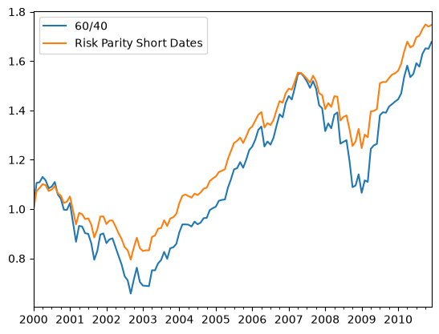

We can also supply arguments to the metrics as keyword arguments.

``` python
compare(p1,p2, metric='roll_return', months=24).plot()
```

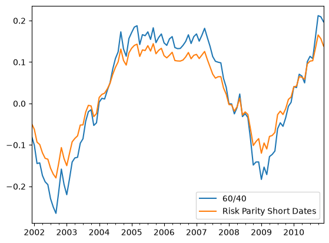

## Portfolio inspection

Statistics on return, risk and correlation of the assets that make up a
portfolio.

------------------------------------------------------------------------

<a
href="https://github.com/northarray/portfolio/blob/main/portfolio/core.py#L177"
target="_blank" style="float:right; font-size:smaller">source</a>

### Portfolio.asset_stats

``` python
def asset_stats():
```

*Expected excess return, volatility and sharpe ratio*

``` python
p.asset_stats()
```

<div>
<style scoped>
    .dataframe tbody tr th:only-of-type {
        vertical-align: middle;
    }
&#10;    .dataframe tbody tr th {
        vertical-align: top;
    }
&#10;    .dataframe thead th {
        text-align: right;
    }
</style>

<table class="dataframe" data-quarto-postprocess="true" data-border="1">
<thead>
<tr style="text-align: right;">
<th data-quarto-table-cell-role="th"></th>
<th data-quarto-table-cell-role="th">bonds</th>
<th data-quarto-table-cell-role="th">stocks</th>
</tr>
</thead>
<tbody>
<tr>
<td data-quarto-table-cell-role="th">expected_return</td>
<td>0.003209</td>
<td>0.051764</td>
</tr>
<tr>
<td data-quarto-table-cell-role="th">volatility</td>
<td>0.021255</td>
<td>0.108144</td>
</tr>
<tr>
<td data-quarto-table-cell-role="th">sharpe_ratio</td>
<td>0.150983</td>
<td>0.478653</td>
</tr>
</tbody>
</table>

</div>

------------------------------------------------------------------------

<a
href="https://github.com/northarray/portfolio/blob/main/portfolio/core.py#L185"
target="_blank" style="float:right; font-size:smaller">source</a>

### Portfolio.risk_contribution

``` python
def risk_contribution():
```

*Per-asset risk contribution as percentage of portfolio variance*

``` python
p.risk_contribution()
```

    bonds     0.062485
    stocks    0.937515
    Name: 60/40, dtype: float64

If a large percentage comes from a single asset it means that this asset
is dominating the volatiltiy and hence the risk-return profile of the
portfolio. Each asset’s contribution is dependent on its allocation
weight and how much each asset correlates with the total portfolio.

------------------------------------------------------------------------

<a
href="https://github.com/northarray/portfolio/blob/main/portfolio/core.py#L194"
target="_blank" style="float:right; font-size:smaller">source</a>

### Portfolio.correlation

``` python
def correlation():
```

*Pairwise correlation matrix of underlying assets and portfolio*

``` python
p.correlation()
```

<div>
<style scoped>
    .dataframe tbody tr th:only-of-type {
        vertical-align: middle;
    }
&#10;    .dataframe tbody tr th {
        vertical-align: top;
    }
&#10;    .dataframe thead th {
        text-align: right;
    }
</style>

<table class="dataframe" data-quarto-postprocess="true" data-border="1">
<thead>
<tr style="text-align: right;">
<th data-quarto-table-cell-role="th"></th>
<th data-quarto-table-cell-role="th">bonds</th>
<th data-quarto-table-cell-role="th">stocks</th>
<th data-quarto-table-cell-role="th">60/40</th>
</tr>
</thead>
<tbody>
<tr>
<td data-quarto-table-cell-role="th">bonds</td>
<td>1.000000</td>
<td>0.152744</td>
<td>0.333235</td>
</tr>
<tr>
<td data-quarto-table-cell-role="th">stocks</td>
<td>0.152744</td>
<td>1.000000</td>
<td>0.982680</td>
</tr>
<tr>
<td data-quarto-table-cell-role="th">60/40</td>
<td>0.333235</td>
<td>0.982680</td>
<td>1.000000</td>
</tr>
</tbody>
</table>

</div>

------------------------------------------------------------------------

<a
href="https://github.com/northarray/portfolio/blob/main/portfolio/core.py#L200"
target="_blank" style="float:right; font-size:smaller">source</a>

### Portfolio.return_drivers

``` python
def return_drivers(
    months:int=60
):
```

*Asset and portfolio rolling return*

``` python
p.return_drivers().plot()
```

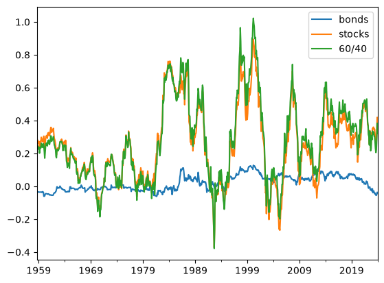

Shows us a different picture of the risk contribution and what is
driving returns. Here the equity asset is clearly driving portfolio
returns.

## Drawdowns

------------------------------------------------------------------------

<a
href="https://github.com/northarray/portfolio/blob/main/portfolio/core.py#L206"
target="_blank" style="float:right; font-size:smaller">source</a>

### Portfolio.drawdown_series

``` python
def drawdown_series(
    assets:bool=False
):
```

*Drawdown series*

``` python
p.drawdown_series().plot()
```

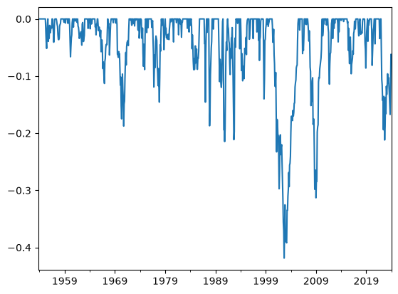

------------------------------------------------------------------------

<a
href="https://github.com/northarray/portfolio/blob/main/portfolio/core.py#L214"
target="_blank" style="float:right; font-size:smaller">source</a>

### Portfolio.max_drawdown

``` python
def max_drawdown():
```

*Worst peak-to-trough decline*

``` python
p.max_drawdown()
```

    -0.4186032934171998

## Decade by decade analysis

------------------------------------------------------------------------

<a
href="https://github.com/northarray/portfolio/blob/main/portfolio/core.py#L220"
target="_blank" style="float:right; font-size:smaller">source</a>

### Portfolio.r_by_decade

``` python
def r_by_decade():
```

*Real return grouped by decade*

``` python
p.r_by_decade().plot(logy=True)
```

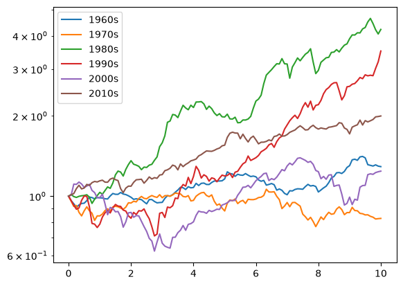

## Leverage

Creating a leveraged portfolio is easy: specify weights that add up to
more than 100%

``` python
p_l = Portfolio("Leveraged", rets, weights={'stocks': 0.65, 'bonds': 0.65}, rf=rf)
p_l
```

    {'stocks': 0.65, 'bonds': 0.65}

``` python
p_u = Portfolio("Unlevered", rets, weights={'stocks': 0.50, 'bonds': 0.50}, rf=rf)
p_u
```

    {'stocks': 0.5, 'bonds': 0.5}

Leveraging a portfolio increases the volatility and return linearly.

``` python
compare(p_l, p_u)
```

<div>
<style scoped>
    .dataframe tbody tr th:only-of-type {
        vertical-align: middle;
    }
&#10;    .dataframe tbody tr th {
        vertical-align: top;
    }
&#10;    .dataframe thead th {
        text-align: right;
    }
</style>

<table class="dataframe" data-quarto-postprocess="true" data-border="1">
<thead>
<tr style="text-align: right;">
<th data-quarto-table-cell-role="th"></th>
<th data-quarto-table-cell-role="th">Leveraged</th>
<th data-quarto-table-cell-role="th">Unlevered</th>
</tr>
</thead>
<tbody>
<tr>
<td data-quarto-table-cell-role="th">expected_return</td>
<td>0.061573</td>
<td>0.047364</td>
</tr>
<tr>
<td data-quarto-table-cell-role="th">volatility</td>
<td>0.126549</td>
<td>0.097345</td>
</tr>
<tr>
<td data-quarto-table-cell-role="th">sharpe_ratio</td>
<td>0.486555</td>
<td>0.486555</td>
</tr>
</tbody>
</table>

</div>

As a result we also get larger swings and drawdowns

``` python
compare(p_u, p_l, metric='drawdown_series').plot()
```

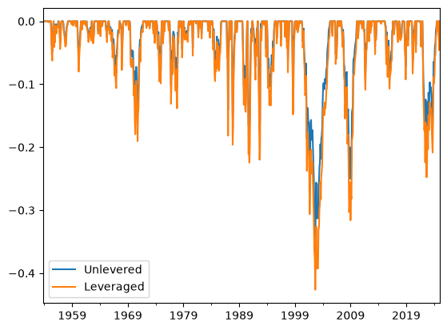

``` python
compare(p_u, p_l, metric='cum_return').plot(logy=True)
```

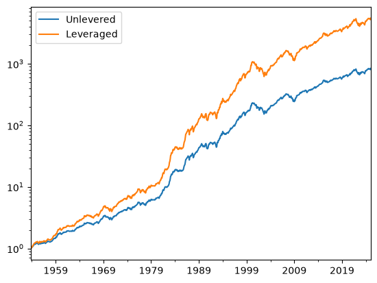

## Risk

------------------------------------------------------------------------

<a
href="https://github.com/northarray/portfolio/blob/main/portfolio/core.py#L233"
target="_blank" style="float:right; font-size:smaller">source</a>

### Portfolio.rolling_vol

``` python
def rolling_vol(
    months:int=24
):
```

*Annualised rolling volatility per asset*

``` python
p.rolling_vol().plot()
```

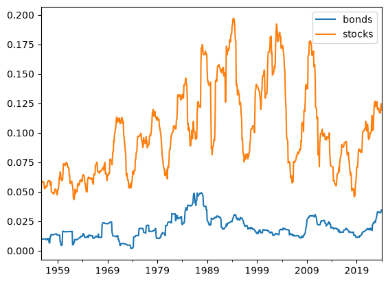

We can normalize these volatilities to get a simple measure of risk
contribution. This ignores covariance and treats each asset as
independent.

------------------------------------------------------------------------

<a
href="https://github.com/northarray/portfolio/blob/main/portfolio/core.py#L239"
target="_blank" style="float:right; font-size:smaller">source</a>

### Portfolio.rc_simple

``` python
def rc_simple():
```

*Simple risk contribution metric*

``` python
rc = p.rc_simple()
```

``` python
rc.plot()
```

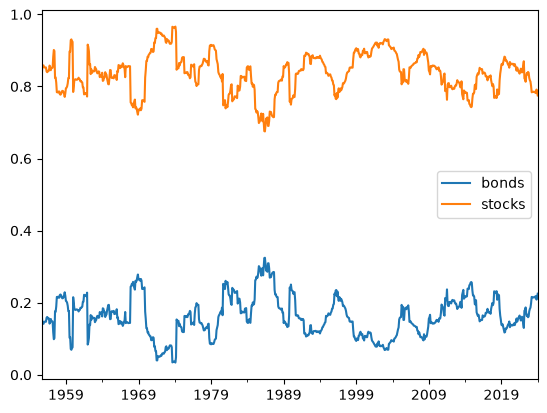
