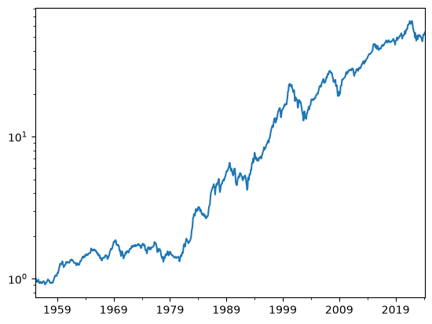

# portfolio


<!-- WARNING: THIS FILE WAS AUTOGENERATED! DO NOT EDIT! -->

Tool for simulating, comparing and visualising the performance of
investment portfolios.

## Usage

### Installation

Install latest from the GitHub
[repository](https://github.com/northarray/portfolio):

``` sh
$ pip install git+https://github.com/northarray/portfolio.git
```

### Documentation

Documentation can be found hosted on this GitHub
[repository](https://github.com/northarray/portfolio)’s
[pages](https://northarray.github.io/portfolio/).

## How to use

Check out core module for full usage. The main idea is that a portfolio
consists of monthly return streams together with a weighing scheme. Here
is a quick intro:

``` python
rets, rf, cpi = sample_data_se()
```

``` python
p = Portfolio('60/40', rets, {'bonds': .40, 'stocks': .60}, rf=rf, cpi=cpi)
p
```

    {'bonds': 0.4, 'stocks': 0.6}

``` python
p.stats()
```

    expected_return    0.055278
    volatility         0.112835
    sharpe_ratio       0.489897
    Name: 60/40, dtype: float64

``` python
p.real_w().head()
```

    1955-02    1.001710
    1955-03    1.010626
    1955-04    0.983135
    1955-05    0.959486
    1955-06    0.945793
    Freq: M, Name: 60/40, dtype: float64

``` python
p.real_w().plot(logy=True)
```


